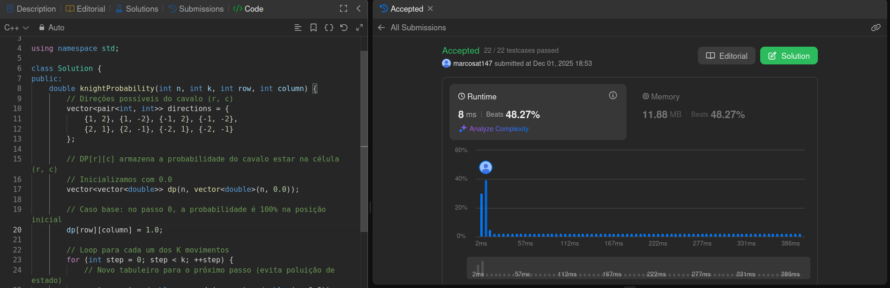
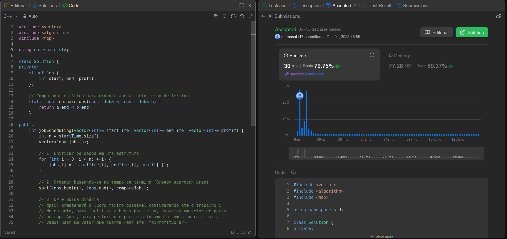
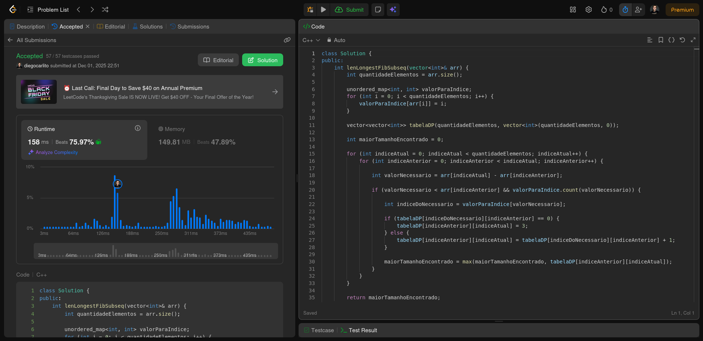

# PD_LeetCode-D17

**Número da Lista**: 5 
**Conteúdo da Disciplina**: Programação Dinâmica

## Alunos
|Matrícula | Aluno |
| -- | -- |
| 22/1007690  |  Diego Carlito Rodrigues de Souza  |
| 22/1008300  |  Marcos Antonio Teles de Castilhos |

## Sobre 
O projeto possui como tema central a resolução de exercícios de programação competitiva com o tema de Programação Dinâmica, utilizando a plataforma de juiz online LeetCode.

## Exercícios

| Exercício | Nível  | Vídeo Explicando |
|---------|--------|------------------|
| [688. Knight Probability in Chessboard](https://leetcode.com/problems/knight-probability-in-chessboard/description/) | Médio | [00:00](https://youtu.be/6356vjJc-CE?si=8goW0SfB8f-YGTxo) |
| [1235. Maximum Profit in Job Scheduling](https://leetcode.com/problems/maximum-profit-in-job-scheduling/description/) | Difícil | [1:15](https://youtu.be/6356vjJc-CE?si=kyFDO4jjXL1xSUor&t=75) |
| [873. Length of Longest Fibonacci Subsequence](https://leetcode.com/problems/length-of-longest-fibonacci-subsequence/description/) | Médio | [2:17](https://youtu.be/6356vjJc-CE?si=kYzHTA1i7VYjh0G_&t=137) |
| [174. Dungeon Game](https://leetcode.com/problems/dungeon-game/description/) | Difícil | [4:00](https://youtu.be/6356vjJc-CE?si=kdaSUxlSxWoa_QIi&t=240) |

[Vídeo explicando todos os exercícios](https://youtu.be/6356vjJc-CE)

## Screenshots

### Exercício 01 - 688 Knight Probability in Chessboard

  
   
  <a href="https://leetcode.com/problems/knight-probability-in-chessboard/submissions/1844425407/">
    Visualizar submissão do exercício 688
  </a>

### Exercício 02 - 1235 Maximum Profit in Job Scheduling

  
   
  <a href="https://leetcode.com/problems/maximum-profit-in-job-scheduling/submissions/1844426320/">
    Visualizar submissão do exercício 1235
  </a>

### Exercício 03 - 873. Length of Longest Fibonacci Subsequence

  
   
  <a href="https://leetcode.com/problems/length-of-longest-fibonacci-subsequence/submissions/1844596968/">
    Visualizar submissão do exercício 873
  </a>

### Exercício 04 - 174. Dungeon Game

  
   
  <a href="https://leetcode.com/problems/dungeon-game/submissions/1844607139">
    Visualizar submissão do exercício 174
  </a>

## Instalação 
**Linguagem**: C++ 

## Verificação

Para validar se a solução implementada está correta, submeta o código no **[LeetCode](https://leetcode.com/)** e verifique se o exercício foi aceito. Cada solução contém o link para a descrição completa do problema no próprio código-fonte.
